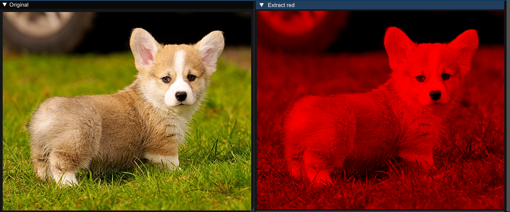
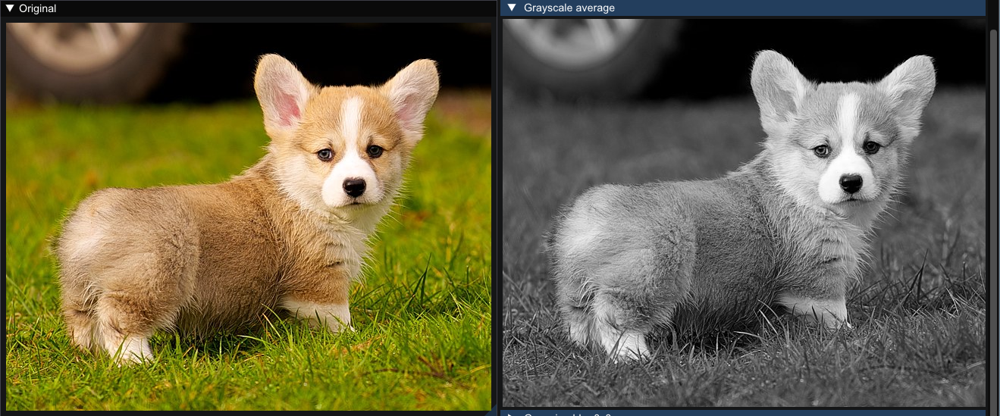
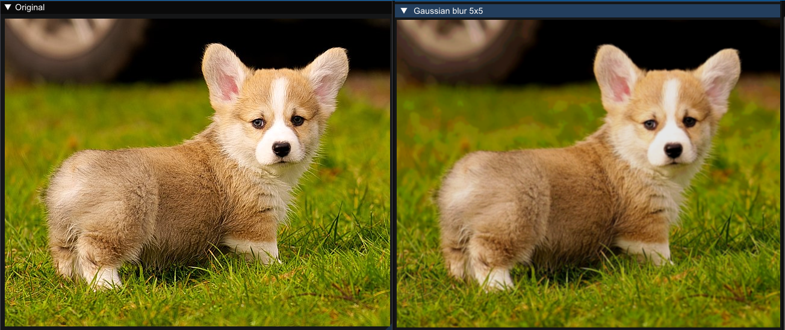
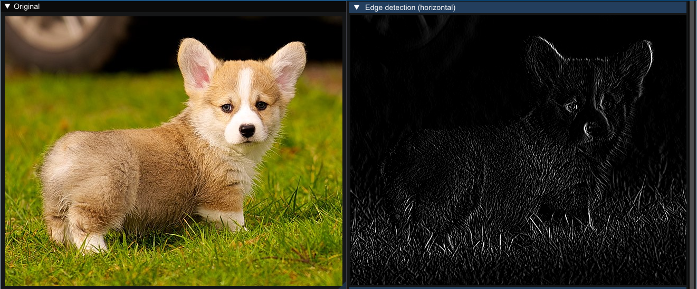
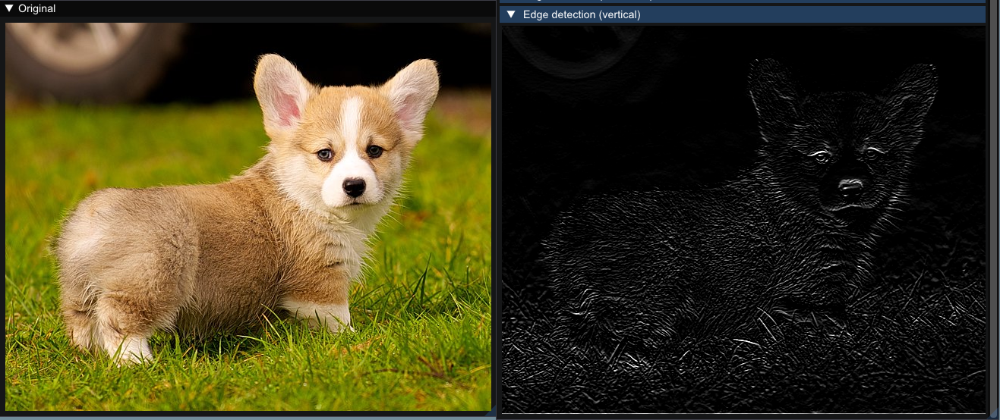

# Image stuff
Some image shenanigans.

**Note: dont use this code - it is not optimized (at least for now) and probably buggy. Any allocations that program does are not freed (even though it does not need to).
This is repo strictly for showcasing what I have done.**

# Things to do
- For now all code lives in main.cpp - split code in multiple files.
- Make this cross platform (why though?) - for now it uses Dear ImGui library + SDL + OpenGL combo.
- Make some performance measurements.
- Optimize convolutions - for now this is just straightforward per pixel multiplication of kernel factors. I have heard about something called Fourier Transforms that can help with optimization
- Probably introduce some SIMD processing?
- For now any image proccessing happens with CPU in memory - we can use shaders and process images in GPU.
- Write even more image processing algorithms.

# Some screenshots

  
Channel extraction

  

  
Grayscaling

  

  
Gaussian blur

  

  
Edge detection (sobel operator) 

  

